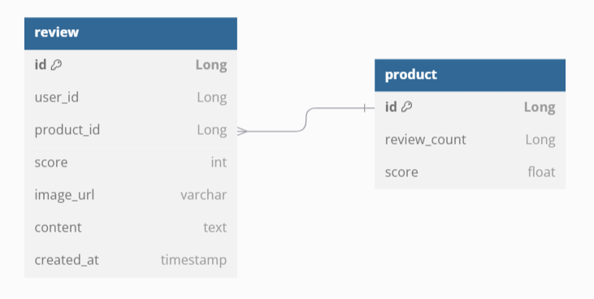
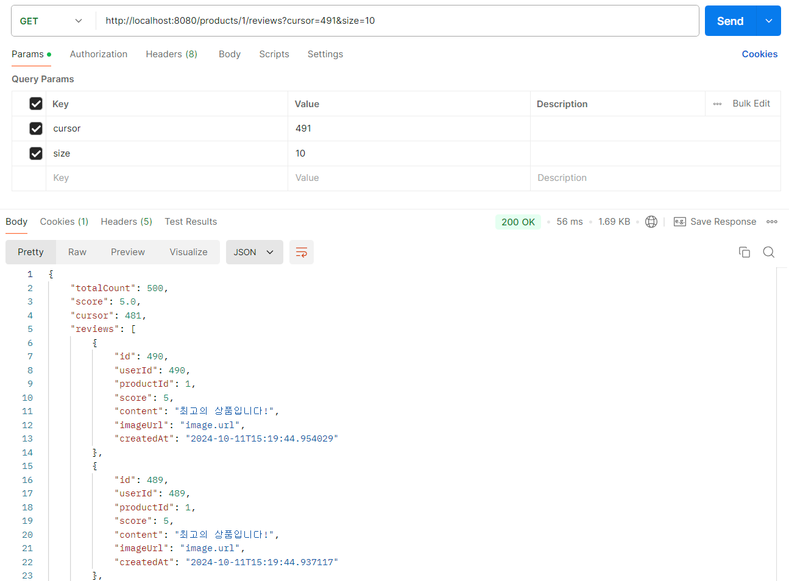
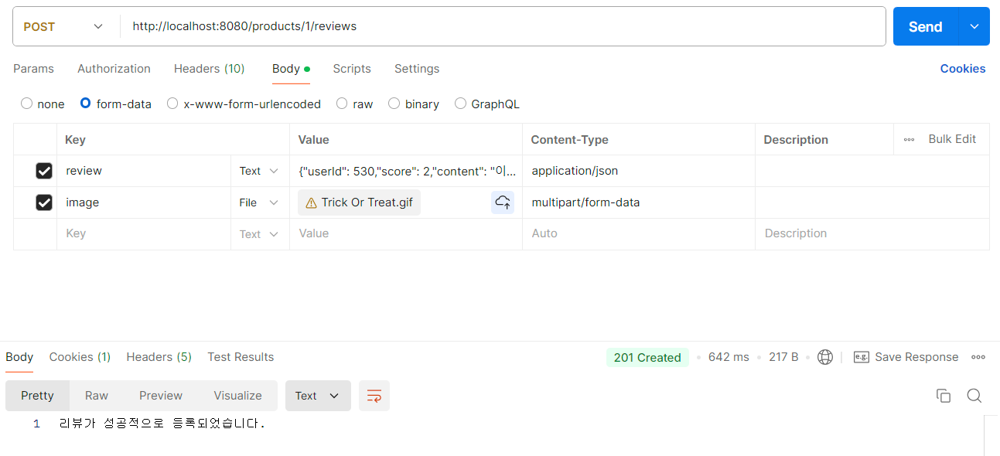
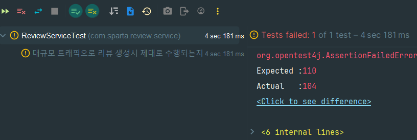
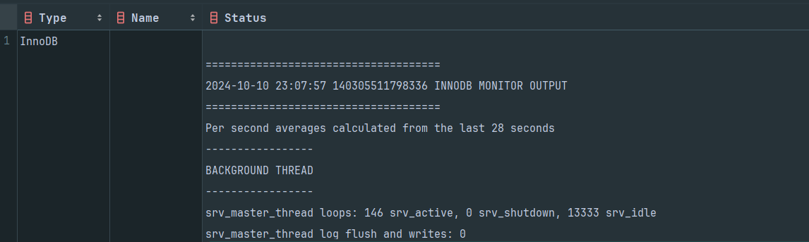

# 과제 1. 리뷰 서비스
항해 99 취업 리부트 코스에서 진행한 기업 과제입니다.

## 프로젝트 소개
## 일정
기간: 2024.10.09 ~ 2024.10.11
## 1. 개발 환경
- Back-end : Java 17, Spring Boot 3.3.5, Spring Data JPA
- Database : MySQL
- infra : docker

## 2. 주요 기능

### 비즈니스 요구 사항
- 리뷰는 존재하는 상품에만 작성할 수 있습니다.
- 유저는 하나의 상품에 대해 하나의 리뷰만 작성 가능합니다.
- 유저는 1~5점 사이의 점수와 리뷰를 남길 수 있습니다.
- 사진은 선택적으로 업로드 가능합니다.
  - 사진은 S3에 저장된다고 가정하고, S3 적재 부분은 dummy 구현체를 생성합니다.
- 리뷰는 '가장 최근에 작성된 리뷰' 순서대로 조회합니다.

### 기술적 요구 사항
- 상품 테이블에 reviewCount와 score가 잘 반영되어야 한다.
- (Optional) 동시성을 고려한 설계를 해주세요. 많은 유저들이 동시에 리뷰를 작성할 때, 발생할 수 있는 문제를 고려해보세요.
- (Optional) 테스트 코드를 작성하면 좋습니다.

<details>
<summary>API 스펙</summary>
<div markdown="1">

### 리뷰 조회 API
- GET /products/{productId}/reviews?cursor={cursor}&size={size}

**RequestParam**
- productId : 상품 아이디
- cursor : 커서 값(직전 조회 API의 응답으로 받은 cursor 값)
- size : 조회 사이즈(default = 10)

**Response Body**

```json
{
    "totalCount": 15, // 해당 상품에 작성된 총리뷰 수
    "score": 4.6, // 평균 점수
    "cursor": 6,
    "reviews": [
       {
            "id": 15,
            "userId": 1, // 작성자 유저 아이디
            "score": 5,
            "content": "이걸 사용하고 제 인생이 달라졌습니다.",
            "imageUrl": "/image.png",
            "createdAt": "2024-11-25T00:00:00.000Z"
       },
       {
            "id": 14,
            "userId": 3, // 작성자 유저 아이디
            "score": 5,
            "content": "이걸 사용하고 제 인생이 달라졌습니다.",
            "imageUrl": null,
            "createdAt": "2024-11-24T00:00:00.000Z"
       }
    ]
}
```
<br>


### 리뷰 등록 API
- POST /products/{productId}/reviews

**Request Part**

[이미지 파일]

MultipartFile 타입의 단건 이미지

[요청부]

```json
{
    "userId": 1,
    "score": 4,
    "content": "이걸 사용하고 제 인생이 달라졌습니다."
}
```

**Response Body**

NONE.

<br>
</div>
</details>

## 3. 기능 구현

### ERD
</img></p>


### 리뷰 조회 API
- GET /products/{productId}/reviews?cursor={cursor}&size={size}

</img></p>


### 리뷰 등록 API
- POST /products/{productId}/reviews

</img></p>

## 4. 문제 해결 과정 
### ✅ @RestControllerAdvice를 사용하여 글로벌 예외 처리를 구현
반복적인 예외를 중앙에서 처리하여 유지 보수성을 향상 시킴
각 예외는 RestApiException 객체로 감싸지며, errMessage, statusCode 필드로 메시지와 상태 코드를 전달한다.
```java
@RestControllerAdvice
public class GlobalExceptionHandler {
    @ExceptionHandler(Exception.class)
    public ResponseEntity<RestApiException> handleGenericException(Exception ex) {
      ...
    }

    @ExceptionHandler({IllegalArgumentException.class})
    public ResponseEntity<RestApiException> illegalArgumentExceptionHandler(IllegalArgumentException ex) {
      ...
    }

    @ExceptionHandler({NoSuchElementException.class})
    public ResponseEntity<RestApiException> NoSuchElementException(NoSuchElementException ex) {
      ...
    }
}
```
```java
@Getter
@AllArgsConstructor
public class RestApiException {
    private String errorMessage;
    private int statusCode;
}
```

### ✅ 쿼리 최적화
총 리뷰 수, 평균 점수를 업데이트할 때 DB에서 조회하지 않고 직접 구해서 쿼리문 두 개를 줄였다.
```
        Long totalCount = reviewRepository.countByProductId(productId);
        Double averageScore = reviewRepository.getAverageScoreByProductId(productId);

        // 총 리뷰 수, 평균 점수 업데이트
        product.updateCountAndScore(totalCount, averageScore);

```

```
        Long newReviewCount = product.getReviewCount() + 1;
        Double newAverageScore = ((product.getScore() * product.getReviewCount()) + newScore)/ newReviewCount;

        // 총 리뷰 수, 평균 점수 업데이트
        product.updateCountAndScore(newReviewCount, newAverageScore);
```

### ✅ 동시성 문제 해결 (비관적 락)

**1. 동시에 리뷰를 생성할 때 문제 확인**

</img></p>

- 여러 스레드가 동시에 createReview()를 호출할 때 리뷰 수와 평균 점수 업데이트가 제대로 이루어지는지 테스트 ->
reviewCount와 score 모두 제대로 결과가 나오지 않음.

**2. 비관적 락 vs 낙관적 락**

리뷰 서비스의 경우에는 읽기 작업이 쓰기 작업보다 많은 것으로 예상되고, 
리뷰 작성의 특성 상 동시에 리뷰를 작성하여 트래픽이 엄청나게 몰리는 경우는 드물다고 생각했다.
처음에는 낙관적 락을 사용해서 문제를 해결하기로 했다.

**3. 낙관적 락에서 데드락 이유 찾기**

</img></p>

낙관적 락으로 구현했는데도 불구하고 데드락이 발생했다.

show engine innodb status; 로 로그를 확인

문제 : 

**4. 외래키 관계 제거 후 계속되는 데드락**


**5. 낙관적 락이 데드락을 해결하지 못한 이유**

**6. 비관적 락 사용 후 문제 해결**

**7. 예상되는 문제점과 느낀 점**